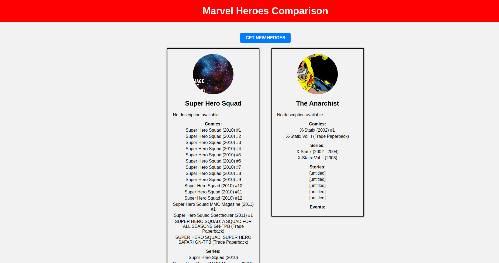

Marvel Heroes Comparison

.

Acesso: https://elc1090.github.io/project2-danieldspx

#### Desenvolvedor(a)
Daniel Pereira

#### Tecnologias

- HTML
- CSS
- Javascript
- Docker
- Jaeger
- OpenTelemetry
- Express
- Node.js

#### Ambiente de desenvolvimento

- VS Code

#### Créditos

- https://developer.marvel.com/docs

---
Projeto entregue para a disciplina de [Desenvolvimento de Software para a Web](http://github.com/andreainfufsm/elc1090-2023a) em 2023a